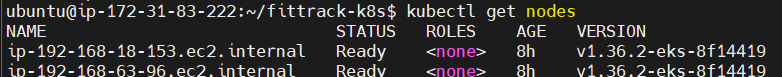
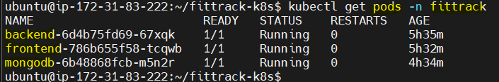
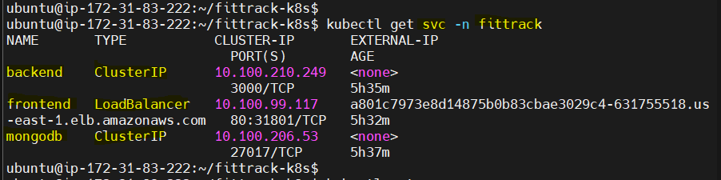
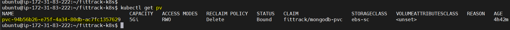
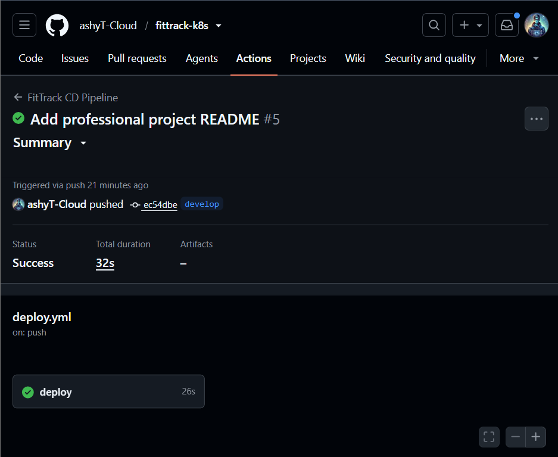

# 🚀 FitTrack - Kubernetes Deployment on Amazon EKS


## 📌 Project Overview

FitTrack is a cloud-native three-tier application deployed on **Amazon Elastic Kubernetes Service (EKS)**.

The project demonstrates how to deploy a containerized application using Kubernetes best practices, including persistent storage, ConfigMaps, Secrets, LoadBalancer Services, and an automated Continuous Deployment (CD) pipeline using GitHub Actions.

---

## 🏗️ Architecture


```
                    Internet
                        │
                        ▼
            AWS Load Balancer Service
                        │
                        ▼
                Amazon EKS Cluster
        ┌──────────────┼──────────────┐
        ▼              ▼              ▼
   Frontend Pod   Backend Pod   MongoDB Pod
                                         │
                                         ▼
                                  Amazon EBS Volume
```

---

## ⚙️ Technologies Used

- Amazon Web Services (AWS)
- Amazon EKS
- Kubernetes
- Docker
- GitHub Actions
- Amazon EBS CSI Driver
- ConfigMaps
- Secrets
- Persistent Volumes
- LoadBalancer Services
- Git
- GitHub

---

## 📂 Project Structure

```text
fittrack-k8s
│
├── .github/
│   └── workflows/
│       └── deploy.yml
│
├── manifests/
│   ├── namespace/
│   ├── config/
│   ├── storage/
│   ├── database/
│   ├── backend/
│   └── frontend/
│
├── diagrams/
├── docs/
├── scripts/
│
├── LICENSE
└── README.md
```

---

## 🚀 Features

- Kubernetes Deployments
- Kubernetes Services
- Amazon EKS
- ConfigMaps
- Secrets
- Persistent Storage using Amazon EBS
- Dynamic Volume Provisioning
- GitHub Actions CD Pipeline
- AWS LoadBalancer Integration
- Namespace Isolation

---

## 🔄 Deployment Workflow

```
Developer
    │
 git push
    │
    ▼
GitHub Actions
    │
Configure AWS Credentials
    │
Update kubeconfig
    │
kubectl apply
    │
Amazon EKS Cluster
```

---

## 📦 Kubernetes Resources

- Namespace
- Deployments
- Services
- ConfigMaps
- Secrets
- StorageClass
- PersistentVolumeClaim
- PersistentVolume

---

## 📸 Screenshots

> Screenshots will be added.

### 1️⃣ Amazon EKS Cluster

**Description:**
This screenshot shows the worker nodes of the Amazon EKS cluster. It confirms that the Kubernetes cluster has been successfully created and all worker nodes are in the **Ready** state.

**Command Used:**
```bash
kubectl get nodes
```



**Description:**
This screenshot displays all application pods running inside the `fittrack` namespace. It verifies that the Frontend, Backend, and MongoDB workloads are healthy and running successfully.

**Command Used:**
```bash
kubectl get pods -n fittrack
```



---
### 3️⃣ Kubernetes Services

**Description:**
This screenshot shows the Kubernetes Services created for the application. The Frontend is exposed using a **LoadBalancer Service**, while the Backend and MongoDB use internal **ClusterIP Services**.

**Command Used:**
```bash
kubectl get svc -n fittrack
```



---
### 4️⃣ Persistent Storage (Amazon EBS)

**Description:**
This screenshot confirms that Kubernetes dynamically provisioned an Amazon EBS volume through the EBS CSI Driver. The Persistent Volume (PV) is successfully bound to the Persistent Volume Claim (PVC) used by MongoDB.

**Command Used:**
```bash
kubectl get pv
```



---

### 5️⃣ GitHub Actions CI/CD Pipeline

**Description:**
This screenshot demonstrates the successful execution of the GitHub Actions Continuous Deployment pipeline. On every push to the configured branch, GitHub Actions authenticates with AWS, updates the EKS kubeconfig, and deploys the latest Kubernetes manifests.



---

### 6️⃣ Running FitTrack Application

**Description:**
This screenshot shows the FitTrack application successfully running through the AWS LoadBalancer endpoint, confirming that the complete deployment on Amazon EKS is operational.


---

## 📚 Learning Outcomes

Through this project I learned:

- Kubernetes architecture
- Amazon EKS deployment
- Container orchestration
- Persistent storage using Amazon EBS
- Kubernetes Secrets & ConfigMaps
- GitHub Actions Continuous Deployment
- IAM authentication with Amazon EKS
- Debugging Kubernetes deployments

---

## 🔮 Future Improvements

- Helm Charts
- Ingress Controller
- Monitoring using Prometheus & Grafana
- Horizontal Pod Autoscaler
- GitOps using ArgoCD

---

## 👨‍💻 Author

Ashish Thakur

GitHub:
https://github.com/ashyT-Cloud# fittrack-k8s
